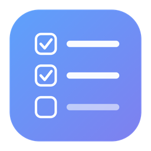

# Kanpan

Kanpan is a Markdown-native Kanban task board for macOS. It tracks projects
through four stages (Not Started, In Progress, On Hold, and Completed), lets you
break large projects into sub-tasks with roll-up progress, and stores everything
as plain `.md` files that you own. You can back the files up, sync them with
iCloud, or edit them in Obsidian.

There is no account, no team layer, and no cloud service. Your tasks are simply
Markdown files on disk.

<p align="center"></p>

## Overview

Kanpan keeps the parts of Microsoft Planner that work well: a small, focused task
model, one-click completion on each card, cards that stay quiet until a field is
set, and drag-to-change-status. It then addresses Planner's main limitation, the
flat 20-item checklist, which falls short when a large project contains many
smaller ones.

The answer is one level of real sub-tasks. Each sub-task has its own status, due
date, and notes. The parent card shows an automatic progress bar, and you can
drill into any sub-task or promote it to a top-level card. This follows the
approach taken by Asana, Linear, and Notion. The full write-up is in
[docs/RESEARCH.md](docs/RESEARCH.md).

## Features

| Feature | Description |
|---|---|
| Two views | Board (Kanban) and Grid (a sortable table), switched from the toolbar or with ⌘1 and ⌘2. |
| Status columns | Not Started, In Progress, On Hold, and Completed, each with a distinct, muted color. Marking a task done moves it to the Completed column. |
| Drag to change status | Drag a card between columns to set its status, or drop it onto another card to reorder within a column. |
| One-click complete | Each card has a checkmark, so you can complete a task without opening it. |
| Sub-projects | Open a card to add sub-tasks, each with its own status, due date, and notes. The parent shows a live progress count. Drag the handle to reorder sub-tasks, drill into any sub-task, or promote it to a top-level card. |
| Works | Each sub-task can hold its own list of "works" (a third level). Works are added, completed, and reordered like sub-tasks, shown under their sub-task with a show/hide toggle, and counted in the task's progress bar. |
| Priority | Urgent, Important, Medium, and Low. Only above-normal priorities show a flag, which keeps boards easy to scan. |
| Labels | Colored, multi-select labels with stable, automatically assigned colors. |
| Due dates | Optional start and due dates. Overdue tasks appear in red. |
| Markdown notes | Every task has a Markdown notes field with a Write and Preview toggle. The detail panel saves and closes when you click outside it. |
| Appearance | Light, Dark, or System. The default follows macOS, and you can force a mode from the sidebar menu. |
| Auto-update | On launch Kanpan checks GitHub Releases and offers to update in place when a newer version is available. You can also check manually from the About window. |
| Vault | Your data is a folder of Markdown files, in the style of Obsidian. You can create, open, or switch vaults, reveal the vault in Finder, and reload from disk. |
| Search | Filter the current board by title, notes, or label. |

## Requirements

macOS 14 (Sonoma) or later.

## Installation

1. Download the latest build from the [Releases page](https://github.com/enderphan94/kanpan/releases), or open `dist/Kanpan-1.4.0.dmg`.
2. Drag Kanpan into the Applications folder.
3. On first launch, right-click Kanpan, choose Open, and confirm. The app is
   ad-hoc signed rather than notarized, so macOS asks for this once.
4. Choose where to keep your vault, or accept the suggested location.

To distribute the app without the right-click step, sign it with a Developer ID
and notarize it.

## How your data is stored

A vault is a single folder. Each board is a folder inside it, and each project is
one Markdown file that contains the project and all of its sub-tasks. A board
with ten projects is ten files, not dozens.

```
My Vault/
  My Board/
    Redesign landing page.md   (a project and its sub-tasks)
    Launch checklist.md
  Personal/
    Taxes.md
```

A project file is readable and editable in any editor. The parent task uses YAML
front matter followed by its notes. Each sub-task begins with a reserved
`<!-- kanpan:subtask -->` line, followed by the same fields and its own notes:

```markdown
---
id: 7F3A2C
title: Redesign landing page
status: in-progress
priority: important
due: 2026-06-15
labels: [Design, Frontend]
order: 2
created: 2026-06-01T10:00:00Z
updated: 2026-06-01T11:30:00Z
---

Project notes in Markdown. Headings, lists, and code all work.

<!-- kanpan:subtask -->
title: Build hero section
status: done
due: 2026-06-10
order: 1

Sub-task notes in Markdown.
```

A few details worth knowing:

- Identity is the `id` field, so renaming a project (and its file) never breaks
  anything.
- Sub-tasks live inside the parent file, one block each. The HTML comment is
  hidden in Obsidian's reading view, while the notes render normally.
- Works are a third level, nested under a sub-task. They use a
  `<!-- kanpan:work -->` block carrying `parent: <sub-task id>`, stored in the
  same project file.
- A plain `.md` file with no front matter is still imported as a project, titled
  after its filename, so an existing vault remains usable.
- Opening a vault created by an older version converts it to the single-file
  layout automatically, after first copying the vault to a backup folder beside
  it.
- A hidden `.kanpan.json` file stores only interface preferences such as board
  order. All task content lives in the Markdown files.

Because the data is just files, you can back it up by copying the folder, sync it
through iCloud or Dropbox, and edit it in Obsidian, VS Code, or vim.

## Build from source

You need macOS 14 or later and the Xcode command-line tools (Swift 5.9 or
later). There are no external dependencies.

```bash
./build.sh      # builds dist/Kanpan.app (compiles, generates the icon, signs)
./make_dmg.sh   # packages dist/Kanpan-<version>.dmg
```

Kanpan is a SwiftUI application compiled directly with `swiftc`, with no Xcode
project file. The scripts assemble the app bundle and the disk image.

## Project layout

```
Kanpan/
  Sources/
    Model.swift          Task status, priority, KTask, and Board types
    Markdown.swift       Front-matter read and write, plus safe file names
    Vault.swift          Filesystem store for boards, tasks, and preferences
    Store.swift          App state and persistence orchestration
    Theme.swift          Status, priority, and label colors
    Components.swift      Shared chips, badges, and menus
    MarkdownView.swift   Lightweight Markdown preview renderer
    Updater.swift        GitHub Releases auto-update
    App.swift            Entry point and menu commands
    WelcomeView.swift    First-launch vault chooser
    AboutView.swift      About window and update controls
    MainView.swift       Sidebar, toolbar, and content shell
    BoardView.swift      The Kanban board
    TaskCardView.swift   A board card
    GridView.swift       The table view
    TaskDetailView.swift Detail panel and sub-task manager
  scripts/make_icon.swift  Generates the app icon with CoreGraphics
  build.sh                 Compile, bundle, and sign
  make_dmg.sh              Package the disk image
  docs/RESEARCH.md         Research notes behind the design
```

## Keyboard shortcuts

| Shortcut | Action |
|---|---|
| ⌘N | New task |
| ⇧⌘N | New board |
| ⌘1 | Board view |
| ⌘2 | Grid view |
| ⌘R | Reload vault from disk |
| ⌘F | Search |
